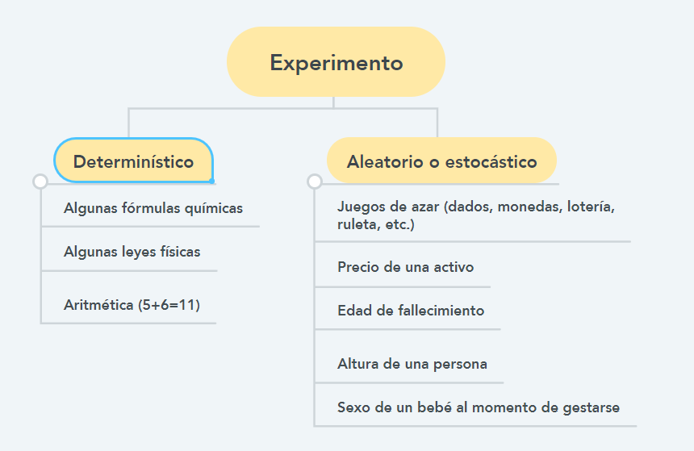

```{r setup, include=FALSE}
knitr::opts_chunk$set(echo = TRUE)
```

[https://rpubs.com/hllinas/R_Exp-Omega-Evento](https://rpubs.com/hllinas/R_Exp-Omega-Evento)

-----------
N.B. Este tutorial corresponde a una versión actualizada del tutorial de referencia del dr. Humberto LLinás, convertido a RMarkdown. Sólo se han actualizado algunos aspectos de Rmarkdown y LaTex, para la reproducción del mismo, sin errores, en 2023, desde RStudio.
-----------

# PROBABILIDAD EN R
## Experimento, espacio muestral y evento

**Dr. rer. nat. Humberto LLinás Solano**
Departamento de Matemáticas y Estadística, Universidad del Norte (Barranquilla, Colombia)

[hllinas@uninorte.edu.co](hllinas@uninorte.edu.co)

[Biographical sketch](https://rpubs.com/hllinas/Bio_Sketch)

26/08/21

### Abstract

La teoría mencionada puede revisarse en el capítulo 2 de mis notas de clase que aparecen en el siguiente documento: [1.1. Estadística básica](https://rpubs.com/hllinas/R_NotasClase). En [Rpubs:: toc](https://rpubs.com/hllinas/toc) se pueden ver otros documentos de posible interés. 

### 0 Preparación del entorno

Los paquetes `prob` y `repmis` no están disponibles desde CRAN, por lo que requieren un procedimiento alterno de instalación. Por ello, se ha creado el breve script en R titulado [R_Prob_Condicional_prerrequisito.R](https://github.com/jzavalar/probabilidad/blob/main/codigo/9.5_Probabilidad-en-R_Probabilidad-condicional.Rmd) que pemite instalarlos y preparar el ambiente para que funcione el tutorial. Ambos paquetes de instalan desde GitHub con el paquete `remotes` y `devtools`. Adicionalmente, se instalan el paquete `rio`, que sirve para preparar los datos de su fuente original, aunque en este repositorio, incluye una copia del repositorio `Datos Publicos` del dr. Humberto LLinás.  

profe J. Zavala (JZ)

```{r}
library(prob)
```


### 1 Paquetes

En R podemos encontrar diversas funciones para ello:

    `expand.grid` en el paquete `base`.
    `combn` en el paquete `combinat`.
    `permsn`, `tosscoin`, etc., en el paquete `prob`.

Para nuestros cálculos, utilizaremos la siguiente librería:

```{r}
#A) Para analizar experimentos estadísticos
library(combinat)
library(prob)
```


### 2 Experimento

Todo experimento se puede clasificar como se ilustra en la figura de abajo:




### 3 Espacio muestral

Teóricamente se simbolizará con $\Omega$. Revisaremos algunos ejemplos para encontrar los elementos de este conjunto.

#### 3.0.1 Ejemplo: Lanzar monedas

Considere el experimento aleatorio de lanzar n veces una moneda. Los resultados elementales son H (head, cara) y T (tail, sello). Con la librería “prob”, Podemos hallar los elementos del espacio muestral con la función “tosscoin” (lanzamiento de monedas):

```{r}
#A) Espacio muestral con n=1 lanzamiento de una moneda
tosscoin(1)
```


```{r}
#B) Espacio muestral con n=2 lanzamientos de una moneda
tosscoin(2)
```

```{r}
#C) Espacio muestral con n=3 lanzamientos de una moneda
tosscoin(3)
```

Para determinar el número de elementos que tiene el espacio muestral $\Omega$ y el de la muestra, se puede utilizar la función “dim”:

```{r}
#D) Espacio muestral con n=10 lanzamientos de una moneda
Omega <- tosscoin(10)  

#E) Tamaños de Omega y de la muestra
dim(Omega)
```

#### 3.0.2 Ejemplo: Lanzar dados

Ahora considere el experimento aleatorio de lanzar n veces un dado. Los resultados elementales son 1, 2, 3,4, 5 y 6. Con la librería `prob` podemos hallar los elementos del espacio muestral con la función `rolldie()` (lanzamiento de dados):

```{r}
#F) Espacio muestral con n=2 lanzamientos de un dado
Omega<- rolldie(2)
Omega

#G) Tamaño de la muestra
dim(Omega)
```
### 4 Evento

Para obtener un evento de $\Omega$, en R, podemos extraer filas usando el operador [].

#### 4.0.1 Ejemplo: Lanzar monedas

```{r}
#A) Espacio muestral: lanzamiento de 3 monedas
Omega <- tosscoin(3)
Omega    

#B) Tamaño de la muestra: filas x columnas 
dim(Omega)

#C) Evento B, las primeras 4 filas
B<- Omega[1:4, ]
B

#D) Evento C, las filas 1 y 4
C<- Omega[c(1,4),]
C
```

#### 4.0.2 Ejemplo: Lanzar dados

```{r}
#E) Espacio muestral de lanzar 2 dados
Omega <- rolldie(2)

# Lista las primeras 10 líneas 
head(Omega)

#F) Tamaño de la muestra
dim(Omega)

#G) Evento G: cojunto para el caso de que 
# la suma de dos columnas es mayor a 10  
G <- subset(Omega, X1 + X2 > 10); G
```

### 5 Funciones para encontrar subconjuntos

#### 5.1 La función (b %in% a)

Retornará TRUE si el valor de un vector b está en algún lugar dentro de otro vector a.

```{r}
#A)
x <- 1:6

#B)
y <- 2:4

#C)
z <- c(2,2,4)

#D)
y %in% x

#E)
x %in% y

#F)
x %in% z

```

#### 5.2 La función all(b %in% a)

La función retornará TRUE si todos los valores del vector b están dentro de otro vector a.

```{r}
#G)
all(y %in% x)

#H)
all(x %in% y)

#I)
all(x %in% z)
```

#### 5.3 La función isin(a,b)

La función retornará TRUE si cada elemento de b está presente en el vector a, contando multiplicidades.

```{r}
#J)
isin(y, x)

#K)
isin(x, y)

#L)
isin(x, y)
```


#### 5.4 La función isin(a,b) con opción ordered

Hay un argumento opcional que prueba si un elemento del vector b aparece en el a en el mismo orden en que ellos aparecen en b. Por ejemplo:

```{r}
#M)
isin(x, c(2, 3, 4), ordered = TRUE)

#N)
isin(x, c(3, 2, 4), ordered = TRUE)
```


#### 5.5 La función isin(a,b) para construir eventos

La función `isin()` se puede aplicar a cada fila del data frama para encontrar el evento deseado. Por ejemplo,

```{r}
#O) Dados, n=3
Omega <- rolldie(3)
head(Omega)

#P) Tamaños de Omega y muestra
dim(Omega)

#Q) Evento
A <- subset(Omega, 
            isin(Omega, c(2, 1), ordered = TRUE))
A

#R) Tamaños del evento y de la muestra
dim(A)

```


### 6 Operaciones con conjuntos

La tabla de abajo resume las operaciones que se pueden calcular con R:


$$
\begin{equation}
\begin{matrix}
Operación                   & Código         \\
Unión: (A \cup B)           & union(A,B)     \\
Intersección: (A \cap B)    & intersect(A,B) \\
Diferencia: (A \setminus B) & setdiff(A,B)   \\
Igualdad: (A = B)           & setequal(A,B)  \\
\end{matrix}
\end{equation} 
$$

Revisemos algunos ejemplos:

```{r}
Omega <- rolldie(2); head(Omega)

#A) Evento A
A <- subset(Omega, isin(Omega, c(2, 1), ordered = TRUE))
A

#B)Evento B
B <- subset(Omega, isin(Omega, c(1, 2), ordered = FALSE))
B

#C) Unión
union(A,B)

#D) Intersección
intersect(A,B)

#E) Diferencia A-B
setdiff(A,B)

#F) Diferencia B-A
setdiff(B,A)

#G) Igualdad
setequal(A,B)
```


### 7 Ejercicios

Dado el experimento aleatorio, encuentre los elementos de los eventos indicados abajo, el número de elementos que contiene y el tamaño de la muestra. Para ello, debe crear un nuevo documento R Markdown. Explique siempre sus afirmaciones y los códigos utilizados. Interprete los resultados hallados.

1. Experimento: Un dado se lanza dos veces.
   a. $\Omega$: El espacio muestral.
   b. Evento B: La suma de los números es 7. Sugerencia: utilizar == para indicar el símbolo de igualdad.
   c. Evento C: La suma de los números es por lo menos un 11.
   d. Evento D: La suma de los números es a lo más un 2.
   e. Evento E: Se obtiene un doble. Sugerencia: utilizar == para indicar el símbolo de igualdad.
   f. Evento F: No se obtiene un doble. Sugerencia: utilizar != para indicar el símbolo de diferente.
   g. Unión de B y F.
   h. Interseción de C y E.
   i. Diferencia C-F.
   j. Evento J: Unión de E y F. Verifique en R si J es igual a $\Omega$.
   k. Intersección de C y D.
   l. Diferencia de B y D.
   m. Evento M: Contiene los elementos de la forma (3,4), ordenados. Sugerencia: utilizar la función isin().
   n. Evento N: Contiene los elementos de la forma (3,4), no ordenados. Sugerencia: utilizar la función isin(). Compare con el evento M.
   o. Evento O: Uno cualquiera obtenido al aplicar la función corchete.

2. Experimento: Una moneda se lanza cuatro veces.
   a. $\Omega$: El espacio muestral.
   b. Evento B: Las primeras 2 observaciones. Utilizar la función corchete.
   c. Evento C: Las primeras 5 observaciones. Utilizar la función corchete.
   d. Unión de B y C.
   e. Intersección de B y C.
   f. Diferencia B-C.
   g. Diferencia C-B.
   h. Evento H: El complemento de B.
   i. Evento I: El complemento de C.
   j. Intersección de B y H.
   k. Evento K: Unión de C y I. Verifique en R si K es igual a $\Omega$.
   l. Evento L: Salgan 2 caras. Sugerencia: utilizar la función isin().
   m. Evento M: Salgan 3 caras. Sugerencia: utilizar la función isin().

### 8 Enlaces y materiales de ayuda

1. IPSUR (Introduction to Probability and Statistics Using R): https://www.nongnu.org/ipsur/
2. LLinás, H.; Rojas, C., *Estadística descriptiva y distribuciones de probabilidad*. Barranquilla: Ediciones Uninorte, 2005.
